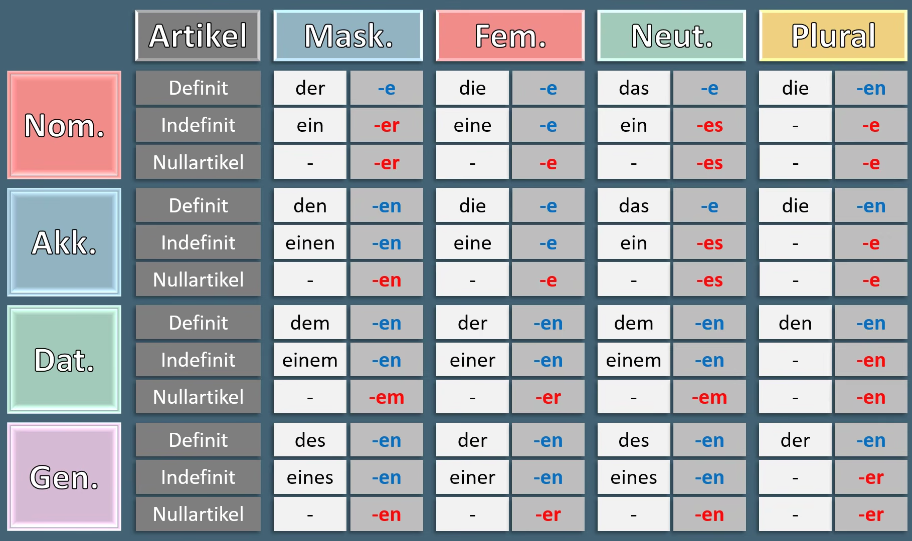

 # Grammatik: Adjektivendungen

> **Ausnahme:** Genitiv Singular, Nullartikel, Mask./Neut. → **-en** statt des erwarteten -es/-en-Musters. Grund: Das Nomen trägt hier selbst schon die Genitiv-Endung (z. B. „gutes Kaffees" wäre doppelt gemoppelt), deshalb übernimmt das Adjektiv die schwache Endung -en.

---

# Demonstrativpronomen

Deklinieren genau wie der Definitartikel (der/die/das-Muster) in der Tabelle oben — gleiche Endungen, nur mit dies-/dieselb-/diejenig- als Stamm.

### dieser / diese / dieses — „dieser hier", zeigt auf etwas Bestimmtes

| Kasus | maskulin | feminin | neutral | Plural |
| --- | --- | --- | --- | --- |
| Nom. | dieser | diese | dieses | diese |
| Akk. | diesen | diese | dieses | diese |
| Dat. | diesem | dieser | diesem | diesen |
| Gen. | dieses | dieser | dieses | dieser |

| Kasus | Beispiel |
| --- | --- |
| Nominativ | Dieser Mann ist mein Nachbar. |
| Akkusativ | Ich sehe diese Frau schon den ganzen Tag. |
| Dativ | Ich helfe diesem Kind bei den Hausaufgaben. |
| Genitiv | Das Verhalten dieser Leute ist seltsam. |

### derselbe / dieselbe / dasselbe — „genau der/die/das identische", nicht nur ähnlich

| Kasus | maskulin | feminin | neutral | Plural |
| --- | --- | --- | --- | --- |
| Nom. | derselbe | dieselbe | dasselbe | dieselben |
| Akk. | denselben | dieselbe | dasselbe | dieselben |
| Dat. | demselben | derselben | demselben | denselben |
| Gen. | desselben | derselben | desselben | derselben |

| Kasus | Beispiel |
| --- | --- |
| Nominativ | Das ist derselbe Mann, den ich gestern gesehen habe. |
| Akkusativ | Ich habe heute dieselbe Frage wie gestern. |
| Dativ | Ich bin mit demselben Kind zur Schule gegangen. |
| Genitiv | Das ist die Meinung derselben Leute wie letztes Mal. |

> derselbe = wirklich das identische Exemplar. der gleiche/die gleiche/das gleiche = ein anderes, aber gleichartiges Exemplar. „Wir haben denselben Wagen" (ein Auto, geteilt) vs. „Wir haben den gleichen Wagen" (zwei Autos, gleiches Modell).

### derjenige / diejenige / dasjenige — „derjenige, der ...", leitet meist einen Relativsatz ein

| Kasus | maskulin | feminin | neutral | Plural |
| --- | --- | --- | --- | --- |
| Nom. | derjenige | diejenige | dasjenige | diejenigen |
| Akk. | denjenigen | diejenige | dasjenige | diejenigen |
| Dat. | demjenigen | derjenigen | demjenigen | denjenigen |
| Gen. | desjenigen | derjenigen | desjenigen | derjenigen |

| Kasus | Beispiel |
| --- | --- |
| Nominativ | Derjenige, der zu spät kommt, muss warten. |
| Akkusativ | Ich suche denjenigen, der das Fenster kaputt gemacht hat. |
| Dativ | Ich danke demjenigen, der mir geholfen hat. |
| Genitiv | Das ist das Büro desjenigen, der die Firma leitet. |

> Wird fast immer vor einem Relativsatz benutzt (formell/schriftlich); der Genitiv ist selten und wirkt gestelzt.

---

# Genus erkennen: der / die / das

## Übersicht auf einen Blick

| | der | die | das |
| --- | --- | --- | --- |
| 🟢 Immer | Wochentage · Monate · Automarken · -ling · -ich · -ismus | Zahlen als Nomen · Schiffe/Flugzeuge/Motorräder (Eigennamen) · -heit · -keit · -schaft | substantivierte Infinitive · substantivierte Adjektive (abstrakt) · -lein · -chen |
| 🟡 Meistens | Jahreszeiten · Tageszeiten · -er · -ant · -ist · -ig · -or · -är · -eur · -ent | -e · -ei · -ung · -ion · -ik · -ur · -tät · -enz | Materialien · -ett · -ium · -ment · -tum · -eau · -ing · -o |

Details, Beispiele und Ausnahmen unten.

Reihenfolge in jeder Tabelle: **🟢 Immer** (zuverlässig, keine/kaum Ausnahmen) zuerst, **🟡 Meistens** danach. *Ausnahmen* stehen rot-kursiv in der letzten Spalte.

### der (maskulin)

**🟢 Immer / fast immer**

| Regel | Beispiele |
| --- | --- |
| Wochentage | der Montag, der Mittwoch, der Samstag, der Sonntag |
| Monate | der Januar, der Februar, der März, der Dezember |
| Automarken | der Volkswagen, der Ferrari, der BMW, der Audi, der Toyota |
| Nachsilbe -ling (>95 %) | der Feigling, der Lehrling, der Frühling, der Schmetterling |
| Nachsilbe -ich (>95 %) | der Teppich, der Kranich, der Rettich |
| Nachsilbe -ismus (>95 %) | der Kapitalismus, der Tourismus, der Optimismus |

**🟡 Meistens**

| Regel | Beispiele | Ausnahme |
| --- | --- | --- |
| Jahreszeiten | der Frühling, der Sommer, der Herbst, der Winter | <em>das Frühjahr</em> |
| Tageszeiten | der Morgen, der Mittag, der Abend | <em>die Nacht</em> |
| Nachsilbe -er | der Koffer, der Lehrer, der Computer | <em>das Fenster, die Mutter</em> |
| Nachsilbe -ant | der Elefant, der Praktikant | — |
| Nachsilbe -ist | der Komponist, der Polizist | — |
| Nachsilbe -ig | der König, der Honig | — |
| Nachsilbe -or | der Motor, der Autor | <em>das Tor</em> |
| Nachsilbe -är | der Bär, der Sekretär | — |
| Nachsilbe -eur | der Friseur, der Ingenieur | — |
| Nachsilbe -ent | der Kontinent, der Student | <em>das Prozent</em> |

### die (feminin)

**🟢 Immer**

| Regel | Beispiele |
| --- | --- |
| Zahlen als Nomen | die Eins, die Zwölf, die Vierundfünfzig |
| Schiffe, Flugzeuge, Motorräder (Eigennamen) | die Boeing, die Titanic, die Yamaha |
| Nachsilbe -heit | die Freiheit, die Gesundheit, die Sicherheit |
| Nachsilbe -keit | die Möglichkeit, die Süßigkeit, die Wirklichkeit |
| Nachsilbe -schaft | die Freundschaft, die Mannschaft, die Wissenschaft |

**🟡 Meistens (>90 %)**

| Regel | Beispiele | Ausnahme |
| --- | --- | --- |
| Nachsilbe -e | die Flasche, die Lampe, die Schule | <em>der Junge, der Name</em> |
| Nachsilbe -ei | die Brauerei, die Bäckerei, die Metzgerei | — |
| Nachsilbe -ung | die Zeitung, die Wohnung, die Übung | — |
| Nachsilbe -ion | die Situation, die Nation, die Diskussion | — |
| Nachsilbe -ik | die Musik, die Politik, die Fabrik | — |
| Nachsilbe -ur | die Kultur, die Natur, die Figur | — |
| Nachsilbe -tät | die Universität, die Realität, die Qualität | — |
| Nachsilbe -enz | die Konferenz, die Existenz, die Tendenz | — |

### das (neutrum)

**🟢 Immer**

| Regel | Beispiele |
| --- | --- |
| Verben als Nomen (substantivierte Infinitive) | das Schreiben, das Lesen, das Laufen |
| Adjektive als Nomen (abstrakt/allgemein) | das Rot, das Blau, das Unbekannte, das Gute |
| Nachsilbe -lein (Diminutiv) | das Vöglein, das Fräulein |
| Nachsilbe -chen (Diminutiv) | das Päckchen, das Mädchen, das Brötchen |

**🟡 Meistens**

| Regel | Beispiele | Ausnahme |
| --- | --- | --- |
| Materialien | das Holz, das Glas, das Metall | <em>die Wolle, der Stahl</em> |
| Nachsilbe -ett | das Bett, das Ballett | — |
| Nachsilbe -ium | das Aquarium, das Stadion | — |
| Nachsilbe -ment | das Medikament, das Dokument | — |
| Nachsilbe -tum | das Datum, das Eigentum | <em>der Reichtum, der Irrtum</em> |
| Nachsilbe -eau | das Niveau, das Plateau | — |
| Nachsilbe -ing | das Training, das Meeting, das Camping | — |
| Nachsilbe -o | das Büro, das Kino, das Foto | <em>der Euro, der Espresso</em> |

---

# Passive werden

| Person    | werden | Example             |
| --------- | ------ | ------------------- |
| ich       | werde  | Ich werde gefragt.  |
| du        | wirst  | Du wirst gefragt.   |
| er/sie/es | wird   | Er wird gefragt.    |
| wir       | werden | Wir werden gefragt. |
| ihr       | werdet | Ihr werdet gefragt. |
| sie/Sie   | werden | Sie werden gefragt. |

### werden in Präteritum

| Person    | wurde   | Example             |
| --------- | ------- | ------------------- |
| ich       | wurde   | Ich wurde gefragt.  |
| du        | wurdest | Du wurdest gefragt. |
| er/sie/es | wurde   | Er wurde gefragt.   |
| wir       | wurden  | Wir wurden gefragt. |
| ihr       | wurdet  | Ihr wurdet gefragt. |
| sie/Sie   | wurden  | Sie wurden gefragt. |

---

# Modalverben — Präsens & Präteritum

| Person    | müssen (Präs.) | müssen (Prät.) | können (Präs.) | können (Prät.) | dürfen (Präs.) | dürfen (Prät.) | sollen (Präs.) | sollen (Prät.) | wollen (Präs.) | wollen (Prät.) | mögen (Präs.) | mögen (Prät.) |
| --------- | -------------- | -------------- | -------------- | -------------- | -------------- | -------------- | -------------- | -------------- | -------------- | -------------- | ------------- | ------------- |
| ich       | muss           | musste         | kann           | konnte         | darf           | durfte         | soll           | sollte         | will           | wollte         | mag           | mochte        |
| du        | musst          | musstest       | kannst         | konntest       | darfst         | durftest       | sollst         | solltest       | willst         | wolltest       | magst         | mochtest      |
| er/sie/es | muss           | musste         | kann           | konnte         | darf           | durfte         | soll           | sollte         | will           | wollte         | mag           | mochte        |
| wir       | müssen         | mussten        | können         | konnten        | dürfen         | durften        | sollen         | sollten        | wollen         | wollten        | mögen         | mochten       |
| ihr       | müsst          | musstet        | könnt          | konntet        | dürft          | durftet        | sollt          | solltet        | wollt          | wolltet        | mögt          | mochtet       |
| sie/Sie   | müssen         | mussten        | können         | konnten        | dürfen         | durften        | sollen         | sollten        | wollen         | wollten        | mögen         | mochten       |

---

# Modalverben — Konjunktiv II

| Person    | müssen   | können   | dürfen   | sollen   | wollen   | mögen    |
| --------- | -------- | -------- | -------- | -------- | -------- | -------- |
| ich       | müsste   | könnte   | dürfte   | sollte   | wollte   | möchte   |
| du        | müsstest | könntest | dürftest | solltest | wolltest | möchtest |
| er/sie/es | müsste   | könnte   | dürfte   | sollte   | wollte   | möchte   |
| wir       | müssten  | könnten  | dürften  | sollten  | wollten  | möchten  |
| ihr       | müsstet  | könntet  | dürftet  | solltet  | wolltet  | möchtet  |
| sie/Sie   | müssten  | könnten  | dürften  | sollten  | wollten  | möchten  |

---

# Personalpronomen — alle Fälle

| Person | Nominativ | Akkusativ | Dativ | Genitiv |
| --- | --- | --- | --- | --- |
| ich | ich | mich | mir | meiner |
| du | du | dich | dir | deiner |
| er | er | ihn | ihm | seiner |
| sie (sg., fem.) | sie | sie | ihr | ihrer |
| es | es | es | ihm | seiner |
| wir | wir | uns | uns | unser |
| ihr | ihr | euch | euch | euer |
| sie (Pl.) | sie | sie | ihnen | ihrer |
| Sie (formell) | Sie | Sie | Ihnen | Ihrer |

> Genitiv-Personalpronomen (meiner, deiner, seiner ...) sind selten und wirken veraltet/literarisch — im Alltag ersetzt man sie meist durch andere Konstruktionen (z. B. „Ich erinnere mich an ihn" statt „Ich erinnere mich seiner").

